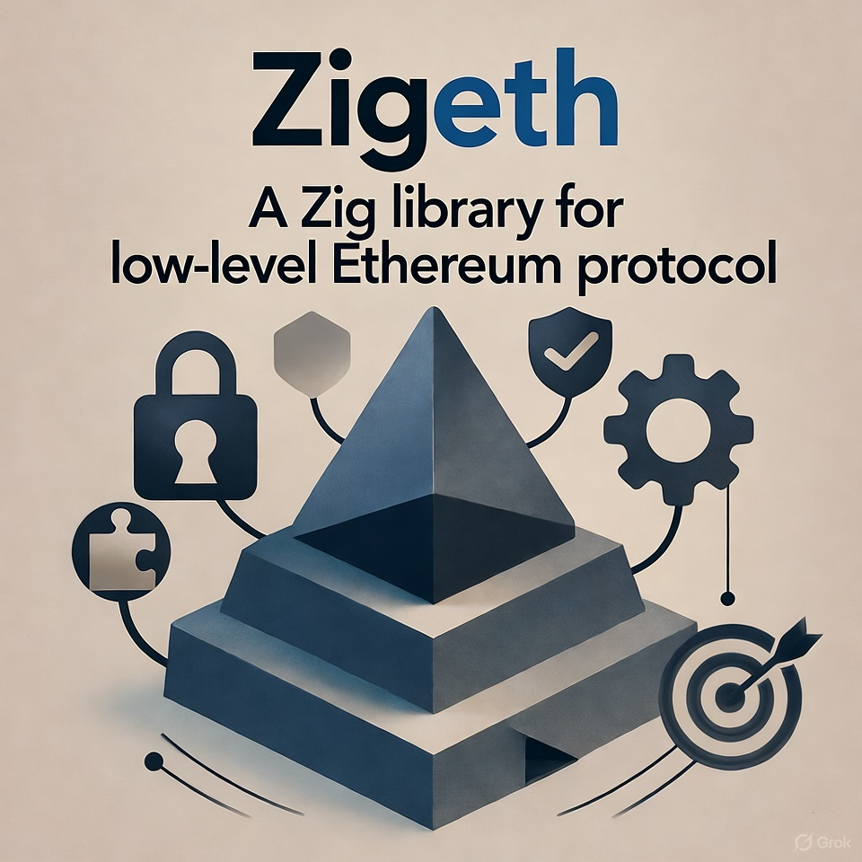

<div align="center">
  
  
  # Zigeth
  
  [](https://github.com/ch4r10t33r/zigeth/actions/workflows/ci.yml)
  [](https://ziglang.org/)
  [](LICENSE)
  [](https://github.com/ch4r10t33r/zigeth/releases)
  
  **A comprehensive Ethereum library for Zig**
  
  Complete cryptographic primitives • Transaction handling • RPC client framework • Smart contract interaction • Wallet management
  
</div>

---

## 📊 Library Readiness Status

| Component | Status | Tests | Description |
|-----------|--------|-------|-------------|
| **🎯 Primitives** | ✅ Production Ready | 48 | Address, Hash, Bytes, Signature, U256, Bloom |
| **📦 Types** | ✅ Production Ready | 23 | Transaction, Block, Receipt, Log, AccessList |
| **🔐 Crypto** | ✅ Production Ready | 27 | Keccak-256, secp256k1, ECDSA, Key management |
| **📡 ABI** | ✅ Production Ready | 23 | Encoding, Decoding, Types, Packed (EIP-712) |
| **📝 Contract** | ✅ Production Ready | 19 | Calls, Deploy, Events, CREATE2 |
| **🌐 RPC** | ✅ Production Ready | 27 | HTTP client, eth/net/web3/debug namespaces |
| **📜 RLP** | ✅ Production Ready | 36 | Encoding, Decoding, Ethereum types |
| **🔌 Providers** | ✅ Production Ready | 26 | HTTP, WebSocket, IPC, Mock, 6+ networks |
| **🧰 Utils** | ✅ Production Ready | 35 | Hex, Format, Units, Checksum (EIP-55/1191) |
| **⚡ Solidity** | ✅ Production Ready | 15 | Type mappings, Standard interfaces |
| **⚙️ Middleware** | ✅ Production Ready | 23 | Gas, Nonce, Transaction Signing |
| **🔑 Wallet** | ✅ Production Ready | 35 | Software, HD, Keystore, Ledger framework |
| **🎯 Account Abstraction** | ✅ Production Ready | - | ERC-4337 (EntryPoint v0.6/v0.7/v0.8, Bundler, Paymaster) |

### Overall Progress
**334/334 tests passing** ✅ | **13/13 modules production-ready** | **9/9 examples working**

---

## 🏗️ Architecture

```
zigeth/
├── src/
│   ├── primitives/           # ✅ Core data types (Address, Hash, U256, etc.)
│   ├── types/                # ✅ Protocol types (Transaction, Block, Receipt)
│   ├── crypto/               # ✅ Keccak-256, secp256k1, ECDSA
│   ├── abi/                  # ✅ ABI encoding/decoding
│   ├── rlp/                  # ✅ RLP encoding/decoding
│   ├── rpc/                  # ✅ JSON-RPC client (eth/net/web3/debug)
│   ├── providers/            # ✅ HTTP, WebSocket, IPC providers
│   ├── contract/             # ✅ Smart contract interaction
│   ├── signer/               # ✅ Wallet management (Software, HD, Keystore)
│   ├── middleware/           # ✅ Gas, Nonce, Signing automation
│   ├── account_abstraction/  # ✅ ERC-4337 (EntryPoint, UserOps, Bundler, Paymaster)
│   ├── sol/                  # ✅ Solidity integration
│   └── utils/                # ✅ Hex, Format, Units, Checksum
│
├── examples/             # ✅ 9 comprehensive examples
│   ├── 01_wallet_creation.zig
│   ├── 02_query_blockchain.zig
│   ├── 03_send_transaction.zig
│   ├── 04_smart_contracts.zig
│   ├── 05_transaction_receipts.zig
│   ├── 06_event_monitoring.zig
│   ├── 07_complete_workflow.zig
│   ├── 08_account_abstraction.zig    # ✅ ERC-4337 quick test
│   ├── 09_etherspot_userop.zig       # ✅ Etherspot integration
│   └── README.md
│
├── build.zig             # Build system
├── build.zig.zon         # Package manifest
└── README.md             # This file
```

## ✨ Key Features

- **🔐 Cryptography**: Keccak-256, secp256k1 ECDSA, key management
- **📝 Transactions**: All 5 types (Legacy, EIP-2930, EIP-1559, EIP-4844, EIP-7702)
- **🌐 RPC Client**: Complete eth/net/web3/debug namespaces (35+ methods)
- **🔌 Multiple Providers**: HTTP, WebSocket, IPC, with 6+ pre-configured networks
- **📜 ABI**: Full encoding/decoding with EIP-712 packed support
- **🔄 RLP**: Complete implementation for Ethereum types
- **📡 Smart Contracts**: Call, deploy, event parsing, CREATE2
- **💼 Wallets**: Software wallets, HD wallets (BIP-32/44), Keystores, Ledger framework
- **⚙️ Middleware**: Automatic gas/nonce management, transaction signing
- **⚡ Solidity**: ERC-20, ERC-721, ERC-1155, Ownable, AccessControl interfaces
- **🎯 Account Abstraction**: ERC-4337 support with EntryPoint v0.6/v0.7/v0.8, bundlers, paymasters
- **🛠️ Utilities**: Hex encoding, unit conversions, EIP-55/1191 checksums
- **🎓 Examples**: 9 comprehensive example programs covering all major use cases

## 📋 Requirements

- **Zig 0.15.0** or later
- **libc** (standard C library)

## 📦 Dependencies

- **[zig-eth-secp256k1](https://github.com/jsign/zig-eth-secp256k1)** - Elliptic curve operations
  - Wraps Bitcoin Core's audited libsecp256k1
  - Used for ECDSA signing, verification, and public key recovery

## 🚀 Getting Started

### Prerequisites

- **Zig 0.15.0** or later ([Download](https://ziglang.org/download/))
- **libc** (standard C library - usually pre-installed)

### Installation

Add zigeth to your `build.zig.zon`:

```zig
.dependencies = .{
    .zigeth = .{
        .url = "https://github.com/ch4r10t33r/zigeth/archive/v0.2.1.tar.gz",
        .hash = "...", // Run `zig build` and Zig will provide the hash
    },
},
```

In your `build.zig`:

```zig
const zigeth = b.dependency("zigeth", .{
    .target = target,
    .optimize = optimize,
});

exe.root_module.addImport("zigeth", zigeth.module("zigeth"));
exe.linkLibC(); // Required for secp256k1
```

Then run:
```bash
zig build
```

### Your First Zigeth Program

Create `src/main.zig`:

```zig
const std = @import("std");
const zigeth = @import("zigeth");

pub fn main() !void {
    var gpa = std.heap.GeneralPurposeAllocator(.{}){};
    defer _ = gpa.deinit();
    const allocator = gpa.allocator();

    // 1. Create a wallet
    var wallet = try zigeth.signer.Wallet.generate(allocator);
    defer wallet.deinit();
    
    const address = try wallet.getAddress();
    const address_hex = try address.toHex(allocator);
    defer allocator.free(address_hex);
    
    std.debug.print("🔑 New wallet created!\n", .{});
    std.debug.print("   Address: {s}\n\n", .{address_hex});
    
    // 2. Connect to Ethereum (Sepolia testnet)
    var provider = try zigeth.providers.Networks.sepolia(allocator);
    defer provider.deinit();
    
    std.debug.print("🌐 Connected to Sepolia testnet\n", .{});
    
    // 3. Query account balance
    const balance = try provider.getBalance(address);
    const eth = try zigeth.utils.units.weiToEther(balance);
    
    std.debug.print("   Balance: {d} ETH\n\n", .{eth});
    
    // 4. Get current block number
    const block_number = try provider.getBlockNumber();
    std.debug.print("📦 Current block: {}\n", .{block_number});
    
    // 5. Get gas price
    const gas_price = try provider.getGasPrice();
    const gwei = gas_price / 1_000_000_000;
    std.debug.print("⛽ Gas price: {} gwei\n", .{gwei});
}
```

Run it:
```bash
zig build run
```

Output:
```
🔑 New wallet created!
   Address: 0x742d35Cc6634C0532925a3b844Bc9e7595f0bEb7

🌐 Connected to Sepolia testnet
   Balance: 0.0 ETH

📦 Current block: 5123456
⛽ Gas price: 1 gwei
```

### Common Use Cases

#### 1. Check ETH Balance

```zig
const address = try zigeth.primitives.Address.fromHex(
    "0x742d35Cc6634C0532925a3b844Bc9e7595f0bEb7"
);

var provider = try zigeth.providers.Networks.mainnet(allocator);
defer provider.deinit();

const balance = try provider.getBalance(address);
const eth = try zigeth.utils.units.weiToEther(balance);
std.debug.print("Balance: {d} ETH\n", .{eth});
```

#### 2. Send ETH Transaction

```zig
// Setup signer
var wallet = try zigeth.signer.Wallet.fromPrivateKeyHex(allocator, private_key);
defer wallet.deinit();

// Create transaction
var tx = zigeth.types.Transaction.newEip1559(allocator);
tx.to = try zigeth.primitives.Address.fromHex("0x...");
tx.value = zigeth.primitives.U256.fromInt(100_000_000_000_000_000); // 0.1 ETH
tx.nonce = try provider.getTransactionCount(wallet.address);
tx.gas_limit = 21000;
tx.max_fee_per_gas = 30_000_000_000; // 30 gwei
tx.max_priority_fee_per_gas = 2_000_000_000; // 2 gwei
tx.chain_id = 11155111; // Sepolia

// Sign and send
const signed_tx = try wallet.signTransaction(&tx);
const tx_hash = try provider.sendRawTransaction(signed_tx);

std.debug.print("Transaction sent: {}\n", .{tx_hash});
```

#### 3. Interact with ERC-20 Token

```zig
// USDC contract on Ethereum
const usdc_address = try zigeth.primitives.Address.fromHex(
    "0xA0b86991c6218b36c1d19D4a2e9Eb0cE3606eB48"
);

// Use built-in ERC-20 interface
const erc20 = zigeth.sol.ERC20;
const balance_of = erc20.getFunctionByName("balanceOf").?;

// Encode function call
const params = [_]zigeth.abi.AbiValue{
    .{ .address = your_address },
};
const call_data = try zigeth.abi.encodeFunctionCall(allocator, balance_of, &params);
defer allocator.free(call_data);

// Call contract
const result = try provider.call(.{
    .to = usdc_address,
    .data = call_data,
});

// Decode result (uint256 balance)
const balance_value = std.mem.readInt(u256, result[0..32], .big);
const usdc_balance = @as(f64, @floatFromInt(balance_value)) / 1_000_000; // USDC has 6 decimals
std.debug.print("USDC Balance: {d}\n", .{usdc_balance});
```

#### 4. Account Abstraction (ERC-4337)

```zig
const aa = zigeth.account_abstraction;

// Create EntryPoint v0.7 instance
const entry_point = try aa.EntryPoint.v07(allocator, &rpc);

// Create smart account
var smart_account = aa.SmartAccount.init(
    allocator,
    account_address,
    entry_point.address,
    .v0_7,
    owner_address,
    &rpc,
    &factory,
    0, // salt
);

// Encode transaction
const call_data = try smart_account.encodeExecute(recipient, value, &[_]u8{});
defer allocator.free(call_data);

// Create UserOperation
const gas_estimates = try gas_estimator.estimateGas(test_op);
const user_op_any = try smart_account.createUserOperation(call_data, gas_estimates);
var user_op = user_op_any.v0_7;

// Get paymaster sponsorship (FREE for user!)
var paymaster = aa.PaymasterClient.init(allocator, paymaster_url, api_key);
defer paymaster.deinit();
try paymaster.sponsorUserOperation(&user_op, entry_point.address, .sponsor);

// Sign and send
const signature = try smart_account.signUserOperation(user_op, private_key);
user_op.signature = signature;

var bundler = aa.BundlerClient.init(allocator, bundler_url, entry_point.address);
defer bundler.deinit();
const user_op_hash = try bundler.sendUserOperation(user_op);

std.debug.print("UserOp sent: {}\n", .{user_op_hash});
```

### Next Steps

1. **Explore Examples**: Check out the 9 examples in [`examples/`](examples/) directory
2. **Read API Docs**: See the full API documentation below
3. **Join Community**: Report issues, request features, contribute!
4. **Build Something**: Create your Ethereum dApp with Zig!

## 📚 Examples

The `examples/` directory contains **9 comprehensive programs** demonstrating all major features:

| Example | Description | Features Demonstrated |
|---------|-------------|----------------------|
| **01_wallet_creation.zig** | Wallet operations | Generation, import, export, mnemonic, HD wallets, keystores |
| **02_query_blockchain.zig** | Blockchain queries | Balance, blocks, gas, nonce, contract detection, multi-chain |
| **03_send_transaction.zig** | Transaction handling | Legacy & EIP-1559 txs, middleware, signing, serialization |
| **04_smart_contracts.zig** | Contract interaction | ERC-20 calls, ABI encoding, events, deployment |
| **05_transaction_receipts.zig** | Receipt queries | Status, fees, logs, contract addresses |
| **06_event_monitoring.zig** | WebSocket events | Subscriptions (newHeads, logs, pending txs) |
| **07_complete_workflow.zig** | End-to-end flow | Complete transaction lifecycle with all components |
| **08_account_abstraction.zig** | ERC-4337 AA | EntryPoint versions, UserOps, gas estimation, paymasters |
| **09_etherspot_userop.zig** | Etherspot integration | Complete AA workflow with Arka & Skandha (v0.7) |

### Running Examples

```bash
# Build all examples
zig build -Dexamples=true

# Run a specific example
zig build run-01_wallet_creation -Dexamples=true
zig build run-02_query_blockchain -Dexamples=true
zig build run-08_account_abstraction -Dexamples=true
zig build run-09_etherspot_userop -Dexamples=true
```

See [`examples/README.md`](examples/README.md) for detailed documentation of each example.

## 🔨 Building

```bash
# Build library
zig build

# Run tests (334 tests)
zig build test

# Build with examples
zig build -Dexamples=true

# Format code
zig build fmt

# Lint (format check + build + tests)
zig build lint

# Generate documentation
zig build docs

# Clean build artifacts
zig build clean
```

## 🌐 Network Providers

Pre-configured providers using Etherspot RPC endpoints:

```zig
// Connect to networks
var mainnet = try zigeth.providers.Networks.mainnet(allocator);
var sepolia = try zigeth.providers.Networks.sepolia(allocator);
var polygon = try zigeth.providers.Networks.polygon(allocator);
var arbitrum = try zigeth.providers.Networks.arbitrum(allocator);
var optimism = try zigeth.providers.Networks.optimism(allocator);
var base = try zigeth.providers.Networks.base(allocator);
var localhost = try zigeth.providers.Networks.localhost(allocator);
```

**Etherspot RPC URLs**:
- Mainnet: `https://rpc.etherspot.io/v2/1?api-key=etherspot_3ZSiRBeAjmYnJu1bCsaRXjeD`
- Sepolia: `https://rpc.etherspot.io/v2/11155111?api-key=etherspot_3ZSiRBeAjmYnJu1bCsaRXjeD`
- Polygon: `https://rpc.etherspot.io/v2/137?api-key=etherspot_3ZSiRBeAjmYnJu1bCsaRXjeD`
- Arbitrum: `https://rpc.etherspot.io/v2/42161?api-key=etherspot_3ZSiRBeAjmYnJu1bCsaRXjeD`
- Optimism: `https://rpc.etherspot.io/v2/10?api-key=etherspot_3ZSiRBeAjmYnJu1bCsaRXjeD`
- Base: `https://rpc.etherspot.io/v2/8453?api-key=etherspot_3ZSiRBeAjmYnJu1bCsaRXjeD`

### Custom Provider

```zig
// HTTP Provider
var provider = try zigeth.providers.HttpProvider.init(
    allocator,
    "https://your-rpc-endpoint.com"
);
defer provider.deinit();

// WebSocket Provider (for subscriptions)
var ws_provider = try zigeth.providers.WsProvider.init(
    allocator,
    "wss://your-ws-endpoint.com"
);
defer ws_provider.deinit();

// IPC Provider (Unix socket)
var ipc_provider = try zigeth.providers.IpcProvider.init(
    allocator,
    "/path/to/geth.ipc"
);
defer ipc_provider.deinit();
```

## 🔑 Wallet Management

```zig
// Generate new wallet
var wallet = try zigeth.signer.Wallet.generate(allocator);

// Import from private key
const key_hex = "0x1234...";
var wallet = try zigeth.signer.Wallet.fromPrivateKeyHex(allocator, key_hex);

// HD Wallet (BIP-32/BIP-44)
const phrase = "word1 word2 ... word12";
var mnemonic = try zigeth.signer.Mnemonic.fromPhrase(allocator, phrase);
const seed = try mnemonic.toSeed("passphrase");
const hd_wallet = try zigeth.signer.HDWallet.fromSeed(allocator, seed);
var account = try hd_wallet.getWallet(0); // First account

// Encrypted Keystore (JSON V3)
const password = "secure-password";
const keystore = try zigeth.signer.Keystore.encrypt(
    allocator,
    private_key,
    address,
    password,
    .pbkdf2
);
```

## ⚙️ Middleware

Automate common transaction tasks:

```zig
// Gas middleware - automatic gas price optimization
const gas_config = zigeth.middleware.GasConfig.fast(); // or .slow, .standard, .custom
var gas = zigeth.middleware.GasMiddleware.init(allocator, provider, gas_config);
const gas_price = try gas.getGasPrice();
try gas.applyGasSettings(&transaction);

// Nonce middleware - automatic nonce management
var nonce = try zigeth.middleware.NonceMiddleware.init(allocator, provider, .hybrid);
defer nonce.deinit();
const next_nonce = try nonce.reserveNonce(address);

// Signer middleware - automatic transaction signing
const signer_config = zigeth.middleware.SignerConfig.mainnet();
var signer = try zigeth.middleware.SignerMiddleware.init(
    allocator,
    private_key,
    signer_config
);
const signature = try signer.signTransaction(&transaction);
```

## 📡 RPC Methods

### eth Namespace (23 methods)
```zig
const block_num = try provider.eth.blockNumber();
const balance = try provider.eth.getBalance(address, .{ .tag = .latest });
const tx = try provider.eth.getTransactionByHash(tx_hash);
const receipt = try provider.eth.getTransactionReceipt(tx_hash);
const gas_price = try provider.eth.gasPrice();
const chain_id = try provider.eth.chainId();
// ... and 17 more methods
```

### net Namespace (3 methods)
```zig
const version = try provider.net.version();
const listening = try provider.net.listening();
const peer_count = try provider.net.peerCount();
```

### web3 Namespace (2 methods)
```zig
const client_version = try provider.web3.clientVersion();
const sha3_hash = try provider.web3.sha3(data);
```

### debug Namespace (7 methods)
```zig
const trace = try provider.debug.traceTransaction(allocator, tx_hash, options);
const block_trace = try provider.debug.traceBlockByNumber(allocator, block_num, options);
// ... and 5 more debug methods
```

## 📝 Smart Contracts

```zig
// ERC-20 Token interaction using standard interfaces
const usdc = try zigeth.primitives.Address.fromHex(
    "0xA0b86991c6218b36c1d19D4a2e9Eb0cE3606eB48"
);

// Use pre-defined ERC-20 interface
const erc20 = zigeth.sol.ERC20;
const balance_of = erc20.getFunctionByName("balanceOf").?;

// Encode function call
const params = [_]zigeth.abi.AbiValue{
    .{ .address = your_address },
};
const call_data = try zigeth.abi.encodeFunctionCall(
    allocator,
    balance_of,
    &params
);

// Make contract call
const result = try provider.eth.call(.{
    .to = usdc,
    .data = call_data,
}, .{ .tag = .latest });
```

## 🔄 Transactions

### All Transaction Types Supported

```zig
// Legacy Transaction
var tx = zigeth.types.Transaction.newLegacy(
    allocator,
    to_address,
    value,
    data,
    nonce,
    gas_limit,
    gas_price,
);

// EIP-1559 Transaction (recommended)
var tx = zigeth.types.Transaction.newEip1559(
    allocator,
    to_address,
    value,
    data,
    nonce,
    gas_limit,
    max_fee_per_gas,
    max_priority_fee_per_gas,
    chain_id,
    access_list,
);

// EIP-7702 Transaction (delegation)
var tx = zigeth.types.Transaction.newEip7702(
    allocator,
    to_address,
    value,
    data,
    nonce,
    gas_limit,
    max_fee_per_gas,
    max_priority_fee_per_gas,
    chain_id,
    authorization_list,
);
```

## 🎓 Learning Path

Start with these examples in order:

1. **Basics**: `01_wallet_creation.zig` - Learn wallet operations
2. **Queries**: `02_query_blockchain.zig` - Read blockchain data
3. **Receipts**: `05_transaction_receipts.zig` - Understand transaction results
4. **Contracts**: `04_smart_contracts.zig` - Interact with smart contracts
5. **Events**: `06_event_monitoring.zig` - Real-time blockchain events
6. **Transactions**: `03_send_transaction.zig` - Send transactions
7. **Complete**: `07_complete_workflow.zig` - Full end-to-end workflow

## 📊 Testing & Quality

```bash
# Run all tests
zig build test

# Run with verbose output
zig build test --summary all

# Run lint checks
zig build lint

# Format code
zig build fmt
```

### Test Coverage

- **Total Tests**: 334 (all passing ✅)
- **Primitives**: 48 tests
- **Types**: 23 tests
- **Crypto**: 27 tests
- **ABI**: 23 tests
- **Contract**: 19 tests
- **RPC**: 27 tests
- **RLP**: 36 tests
- **Providers**: 26 tests
- **Utils**: 35 tests
- **Solidity**: 15 tests
- **Middleware**: 23 tests
- **Wallets**: 35 tests

### CI/CD

- ✅ GitHub Actions workflow
- ✅ Multi-platform builds (Linux, macOS, Windows)
- ✅ Automated testing on every PR
- ✅ Code formatting checks
- ✅ Build verification (Debug & ReleaseSafe)
- ✅ Caching for fast builds (~30s)

## 🗺️ Roadmap

All core functionality is **complete** and **production-ready**!

### ✅ Phase 1: Core Foundation (Complete)
- ✅ Primitives (Address, Hash, Bytes, Signature, U256, Bloom)
- ✅ Cryptography (Keccak-256, secp256k1, ECDSA)
- ✅ Transaction types (All 5 types: 0-4)
- ✅ Block and receipt structures

### ✅ Phase 2: Communication Layer (Complete)
- ✅ JSON-RPC client with HTTP transport
- ✅ eth/net/web3/debug namespaces (35+ methods)
- ✅ WebSocket provider with subscriptions
- ✅ IPC provider (Unix sockets)
- ✅ Network presets (6+ chains)

### ✅ Phase 3: Data Encoding (Complete)
- ✅ RLP encoding/decoding
- ✅ ABI encoding/decoding
- ✅ Packed encoding (EIP-712)
- ✅ Transaction serialization

### ✅ Phase 4: High-Level APIs (Complete)
- ✅ Smart contract interaction
- ✅ Event parsing and filtering
- ✅ Contract deployment (CREATE, CREATE2)
- ✅ Solidity integration (ERC standards)

### ✅ Phase 5: Production Ready (Complete)
- ✅ Middleware (Gas, Nonce, Signing)
- ✅ Wallet management (Software, HD, Keystore)
- ✅ Account Abstraction (ERC-4337 with multi-version support)
- ✅ Comprehensive examples (9 programs)
- ✅ Complete documentation
- ✅ CI/CD and auto-releases
- ✅ 334 passing tests

### ✅ Phase 6: Account Abstraction (Complete)
- ✅ EntryPoint v0.6, v0.7, v0.8 support
- ✅ UserOperation types and validation
- ✅ Bundler client (RPC integration)
- ✅ Paymaster client (sponsorship & ERC-20 payments)
- ✅ Smart Account management
- ✅ Gas estimation (local & RPC)
- ✅ Complete type conversions and serialization
- ✅ Etherspot integration examples

## 🚀 Releases & Versioning

Zigeth uses **semantic versioning** with automated releases:

### Current Version
- **v0.1.0** - Initial production release

### Release Process
- Merging to `master` triggers automatic versioning
- Commit messages determine version bump:
  - `feat:` → Minor version (0.1.0 → 0.2.0)
  - `fix:` → Patch version (0.1.0 → 0.1.1)
  - `BREAKING CHANGE:` → Major version (0.1.0 → 1.0.0)
- GitHub workflow creates:
  - Git tag
  - GitHub release with artifacts
  - Pull request for version file updates

### Skip a Release
Include `[skip ci]` or `[skip release]` in commit message

See [`RELEASING.md`](RELEASING.md) for details.

## 📚 API Overview

### Primitives
- `Address` - 20-byte Ethereum addresses with EIP-55 checksums
- `Hash` - 32-byte Keccak-256 hashes
- `Bytes` - Dynamic byte arrays
- `Signature` - ECDSA signatures with EIP-155 support
- `U256` - 256-bit unsigned integers with full arithmetic
- `Bloom` - 2048-bit bloom filters

### Cryptography
- `keccak256()` - Keccak-256 hashing
- `PrivateKey` / `PublicKey` - secp256k1 key pairs
- `Signer` - ECDSA signing and verification
- Deterministic nonces (RFC 6979)

### Transaction Types
- **Legacy** (Type 0) - Original Ethereum transactions
- **EIP-2930** (Type 1) - Access list transactions
- **EIP-1559** (Type 2) - Fee market transactions (recommended)
- **EIP-4844** (Type 3) - Blob transactions
- **EIP-7702** (Type 4) - Delegation transactions

### Smart Contracts
- Function call encoding/decoding
- Event log parsing
- Contract deployment (CREATE, CREATE2)
- Standard interfaces (ERC-20, ERC-721, ERC-1155)

### Utilities
- **Hex**: Encoding/decoding
- **Format**: Address/hash display, number formatting
- **Units**: Wei ↔ Gwei ↔ Ether conversions
- **Checksum**: EIP-55 and EIP-1191 checksummed addresses

## 🤝 Contributing

Contributions are welcome! Please follow these guidelines:

1. **Code Style**: Run `zig build fmt` before committing
2. **Tests**: Add tests for new features
3. **Documentation**: Update relevant docs
4. **Commits**: Use conventional commits (feat:, fix:, docs:)

## 📄 License

MIT License - see [LICENSE](LICENSE) for details

## 🙏 Acknowledgments

- **[zig-eth-secp256k1](https://github.com/jsign/zig-eth-secp256k1)** - Elliptic curve cryptography
- **Bitcoin Core** - libsecp256k1 implementation
- **Ethereum Foundation** - Protocol specifications
- **Etherspot** - RPC infrastructure

## 🔗 Resources

- **Zig Language**: https://ziglang.org/
- **Ethereum**: https://ethereum.org/
- **EIPs**: https://eips.ethereum.org/
- **Etherspot RPC**: https://etherspot.io/

---

<div align="center">
  <strong>Built with ❤️ using Zig</strong>
  <br/>
  <sub>Production-ready Ethereum development for Zig</sub>
</div>
